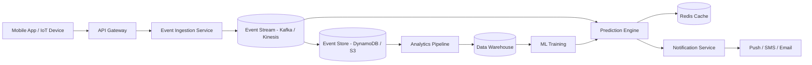

# 🐾 PottyIQ for Pets

PottyIQ for Pets is a predictive pet-care platform that analyzes behavioral events such as feeding, water intake, walks, sleep, and prior potty activity to generate timely potty alerts for pet owners.

This project demonstrates **end-to-end system design thinking**, focusing on event-driven architecture, scalability, and real-time decision-making.

---

## 🎯 Problem

Pet owners often struggle to predict potty timing, especially for young pets or during training phases. This leads to inconsistent routines and frequent accidents.

The challenge is to design a system that can:

- Continuously track pet activity signals  
- Predict the next likely potty window  
- Notify owners at the right time  

---

## 🧠 Solution Overview

PottyIQ processes pet activity events and applies rule-based logic to estimate the next potty window. Based on predictions, it triggers alerts to help pet owners act proactively.

The system is designed as a **real-time, event-driven pipeline** that separates ingestion, prediction, and notification for scalability and resilience.

---

## 🏗️ High-Level Architecture

Key components:

- **Client Layer**: Mobile app / IoT devices capturing pet activity  
- **API Layer**: Validates and ingests events  
- **Event Stream**: Decouples ingestion from processing (Kafka/Kinesis)  
- **Event Store**: Stores historical activity (DynamoDB/S3)  
- **Prediction Engine**: Computes next potty window  
- **Notification Service**: Sends alerts asynchronously  
- **Analytics Layer**: Enables batch insights and ML training  

---

## 🏗️ Architecture Diagram



## 🔄 System Flow
Pet activity events are captured via app or device
Events are ingested through APIs and pushed to an event stream
Prediction engine consumes events and evaluates recent + historical patterns
System computes the next probable potty window
Notification service asynchronously sends alerts

## 📊 Scale Assumptions
~1M pets
~10–20 events per pet per day
→ ~10–20M events/day
Peak ingestion: ~500–1K events/sec

The system is designed to scale horizontally using partitioned streaming and stateless services.

## ⚖️ Key Design Decisions & Tradeoffs
Rule-based vs ML-based prediction
Rule-based enables explainability and rapid iteration
ML improves long-term accuracy and personalization
Real-time vs batch processing
Real-time improves user experience (timely alerts)
Batch enables analytics and model training
Caching vs database reads
Cache reduces latency for recent activity
Tradeoff: slight staleness vs performance

## ⚙️ Scalability & Data Design
Partitioning by petId ensures even load distribution
Stateless prediction services enable horizontal scaling
Event stream supports replay and backpressure handling
Hot data cached (Redis), cold data stored in S3/DynamoDB

## ⚠️ Failure Handling
Event stream ensures durability and replay
Idempotent processing avoids duplicate predictions
Notification retries handled asynchronously
Graceful fallback to last known patterns if prediction fails

## ⏱️ Latency Goals
Event ingestion: < 50 ms
Prediction: < 100 ms
Notification trigger: near real-time (< 1 sec end-to-end)

## 🔒 Privacy & Data Considerations
Minimal personally identifiable information stored
Pet data logically isolated per user
Configurable data retention policies

## 🧪 Prototype

A lightweight prototype demonstrates the core PottyIQ workflow:

- Event ingestion from sample data  
- Rule-based prediction logic  
- Alert generation  

👉 See working prototype in [`/prototype`](./prototype)


### Files
- `sample_events.json` — sample events  
- `predictor.py` — prediction logic  

### How to run

```bash
cd prototype
python predictor.py
```
### Example output from running the prototype locally:

### Sample output

```text
=== PottyIQ Prototype ===

Prediction result:
- Rule used: feed-rule
- Next potty window: 2026-03-31 09:30 AM to 2026-03-31 11:00 AM
- Alert owner at: 2026-03-31 09:20 AM
```
This prototype validates the event-driven flow and explainable rule evaluation before evolving toward ML-based prediction.

## 🚀 Future Enhancements
ML-based personalized prediction
Breed/age/activity-aware models
IoT integrations for automated signal capture
Multi-pet household optimization
Advanced analytics dashboards

## ⚠️ Disclaimer

This is a conceptual system design project created for learning and demonstration purposes.
It does not represent any proprietary system or real-world production implementation.
