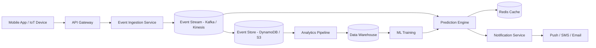

# pottyiq-for-pets
# 🐾 PottyIQ for Pets

PottyIQ for Pets is a predictive pet-care platform that analyzes behavioral events such as feeding, water intake, walks, sleep, and prior potty activity to generate timely potty alerts for pet owners.

This project demonstrates system design thinking with a focus on event-driven architecture, scalability, and real-time decision-making.

---

## 🎯 Problem

Pet owners often struggle to predict potty timing, especially for young pets or during training phases. This leads to inconsistent routines and frequent accidents.

The challenge is to design a system that can:
- Continuously track pet activity signals  
- Predict the next likely potty window  
- Notify owners at the right time  

---

## 🧠 Solution Overview

PottyIQ processes pet activity events and applies rule-based logic to estimate the next potty window. Based on predictions, it triggers alerts to help pet owners act proactively.

---

## 🏗️ High-Level Architecture

The system is designed as an event-driven platform with the following components:

- **Client Layer**: Mobile app / device capturing pet activity events  
- **API Layer**: Receives and validates incoming events  
- **Event Store**: Stores pet activity history  
- **Prediction Engine**: Evaluates behavioral patterns and predicts potty timing  
- **Notification Service**: Sends alerts to users  
- **Analytics Layer**: Aggregates data for future improvements  

## 🏗️ Architecture Diagram

---

## 🔄 System Flow

1. Pet activity events (feeding, water intake, walks, sleep, potty) are captured via app or device  
2. Events are sent to backend APIs and stored in the event store  
3. Prediction engine processes recent activity and historical patterns  
4. System calculates the next probable potty window  
5. Notification service sends reminders to the pet owner  

---

## ⚖️ Key Design Decisions & Tradeoffs

- **Rule-based vs ML-based prediction**  
  Rule-based logic enables faster iteration and explainability, while ML can improve accuracy over time  

- **Real-time vs batch processing**  
  Real-time predictions improve user experience, but increase compute cost  

- **Caching vs database reads**  
  Caching recent pet activity reduces latency but may introduce slight data staleness  

---

## 📈 Scalability Considerations

Although individual pets generate moderate data, the system is designed as a multi-tenant platform supporting a large subscriber base.

- Designed to handle **millions of daily events** from devices and applications  
- Event-driven ingestion to absorb traffic spikes  
- Stateless prediction services for horizontal scaling  
- Partitioning data by pet/user for efficient access  
- Asynchronous notification handling to ensure reliability  

---

## 🔒 Privacy & Data Considerations

- Pet and user data handled with strict privacy controls  
- Minimal personally identifiable information stored  
- Data retention policies can be applied for historical events  

---

## 🧪 Prototype (Optional)

A lightweight prototype is included to simulate:
- Event ingestion  
- Rule-based prediction  
- Alert generation  

---

## 🚀 Future Enhancements

- Machine learning-based prediction models  
- Personalization based on breed, age, and behavior  
- IoT device integration for automated event capture  
- Advanced analytics dashboard  

---

## ⚠️ Disclaimer

This is a conceptual system design project created for learning and demonstration purposes.  
It does not represent any proprietary system or real-world production implementation.

---
