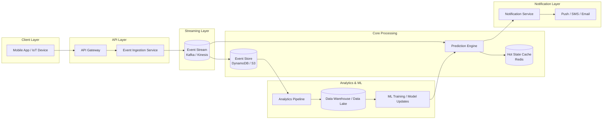

# System Architecture Diagram

This diagram illustrates the end-to-end event-driven architecture for PottyIQ, showing how pet activity signals are ingested, processed, and used to generate real-time predictions and alerts.

# System Diagram

## 🔄 High-Level Flow

1. Pet activity events are captured via mobile app or IoT devices  
2. Events are ingested through API and pushed to a streaming system  
3. Prediction engine processes real-time and historical signals  
4. System computes the next probable potty window  
5. Notification service sends alerts to the user  
6. Historical data feeds into analytics and ML training
   
## 🧠 Design Principles

- **Decoupled architecture** using event streaming for scalability  
- **Separation of concerns** between ingestion, processing, and notification  
- **Real-time + batch hybrid** for responsiveness and learning  
- **Horizontal scalability** through partitioning by petId  
- **Resilience** via durable event storage and replay capability  
